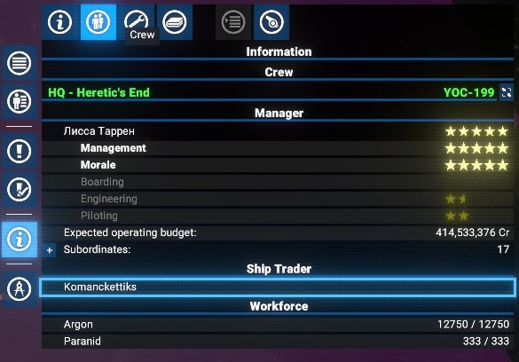
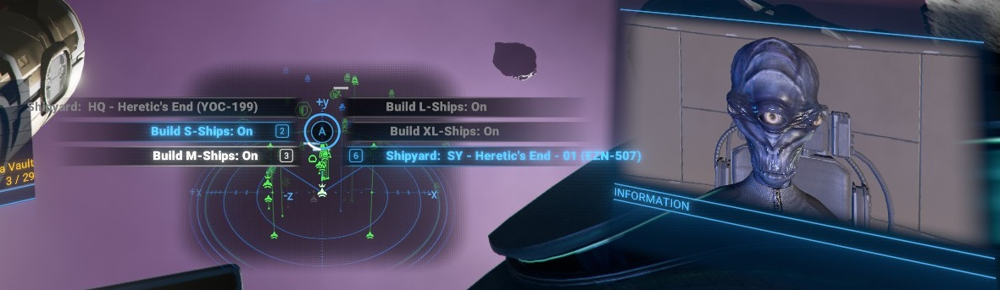
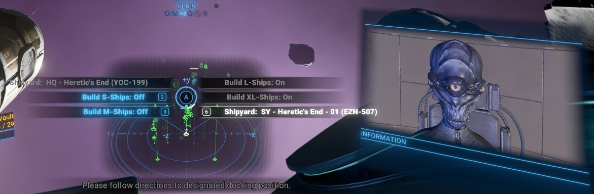

# X4 - Lost Ship Replacement Filters for the Shipyards

This extension allows you to exclude some Shipyards from the list of available for the Lost Ship Replacement.
Filtering can be made by the ship class, i.e. per S, M, L, XL ships.

## Compatibility

Compatible with `X4: Foundations 7.50`. At least it has been written for feature introduced in this version.

## Features

Possibility to configure exclusions of any Shipyards via the interface of any Ship Dealer.
You can easily select which Shipyards are allowed to produce selected ship classes.

## How it works

After installation, you will see a new button in the Ship Dealer interface.
By clicking on it, you will have the possibility to go through all your shipyards and select which of them are allowed to produce selected ship classes.
When it is configured and some of your ships are destroyed, the appropriate shipyard will be selected for the Lost Ship Replacement based on the configuration and distance to the shipyard from the sector where the ship was destroyed.

## Download

You can download the latest version via Steam client - [Lost Ship Replacement Filters](https://steamcommunity.com/sharedfiles/filedetails/?id=3439691722)
Or you can do it via the NexusMods: [Lost Ship Replacement Filters](https://www.nexusmods.com/x4foundations/mods/1640)

## Configuration

Simply go to the Information window of any of your Shipyards and select the `Crew` tab.

There you will see the name of Ship Dealer on that Shipyard, and can open the interface by pressing the right mouse button and selecting the option `Comm`.

In the open interface of interactions with NPC, you will see the new button `Lost Ship Replacement Filters`.

By clicking on it, you will see the updated buttons, with the Shipyard name in the top left (disabled) one and then the buttons for each ship class. If you have more than one Shipyard, the last one, right-down button will show the next Shipyard name and ID.

By clicking on the ship class button, you will toggle the allowance of the Shipyard to produce ships of that class for Lost Ship Replacement.

And if you disable all classes for the Shipyard, it will be excluded from the Lost Ship Replacement.

If some classes can't be produced by the Shipyard, the button will be disabled. But in the configuration, that class will be allowed to be produced by the Shipyard. And when and if you enable that class, please don't forget to check the Shipyard for the possibility to produce that class.

[Video demonstration](https://www.youtube.com/watch?v=Q2ByOWktxmM)

## Links

There is a thread on EgoSoft forum - [[Mod/MDScript] Lost Ship Replacement Filters](https://forum.egosoft.com/viewtopic.php?t=470010). Feel free to ask any questions or report issues there.
